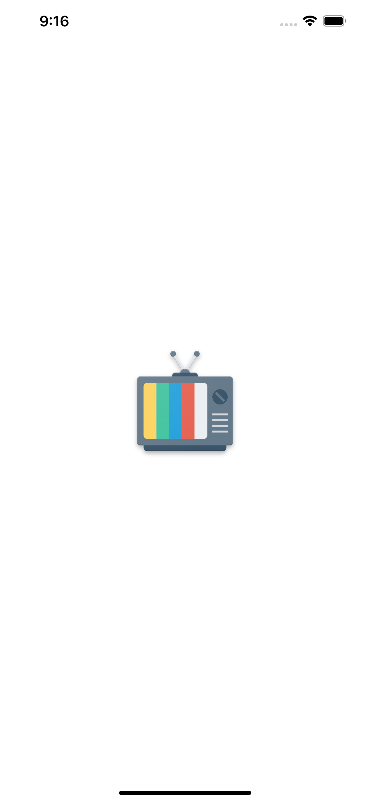
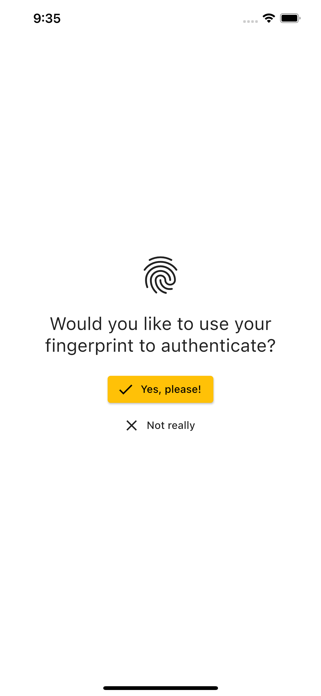
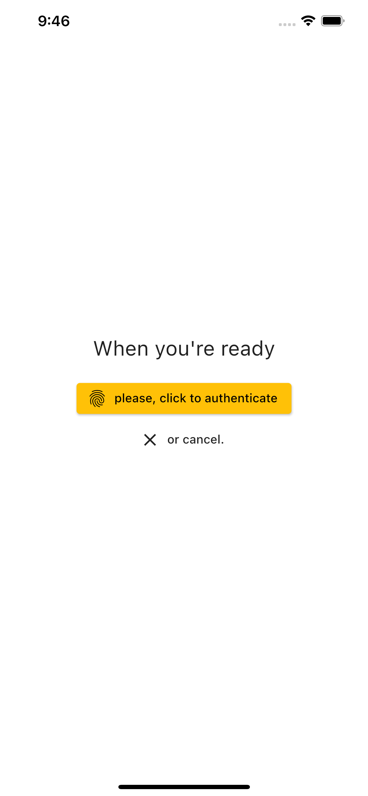
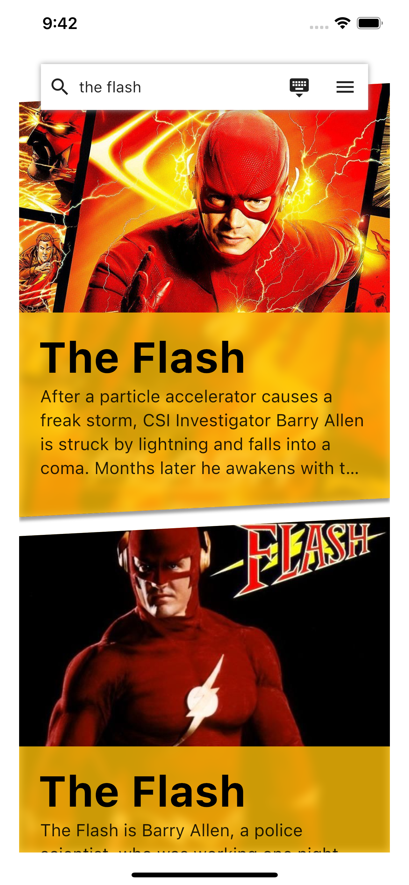
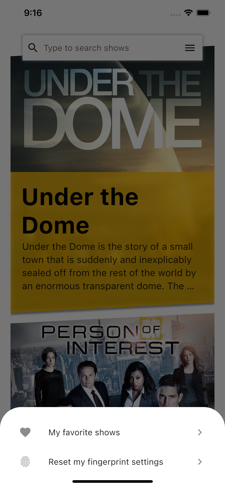
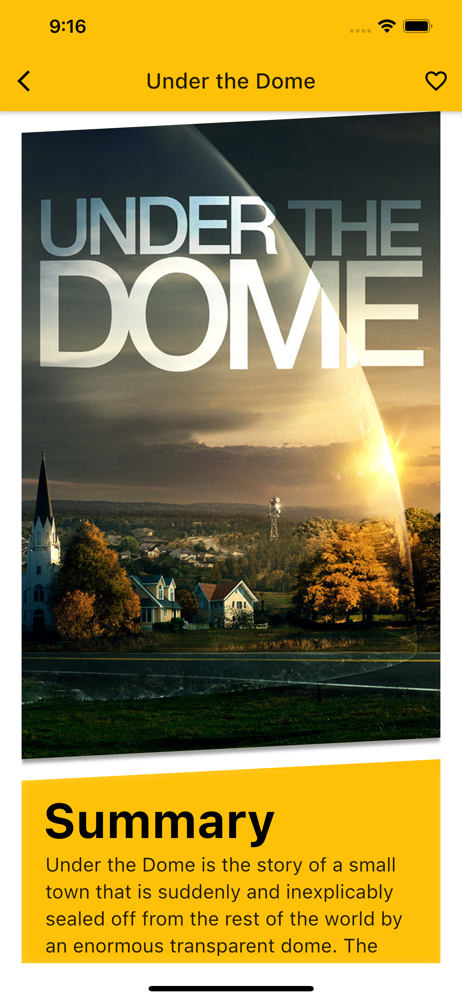
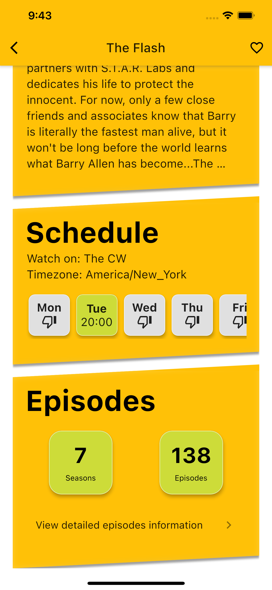
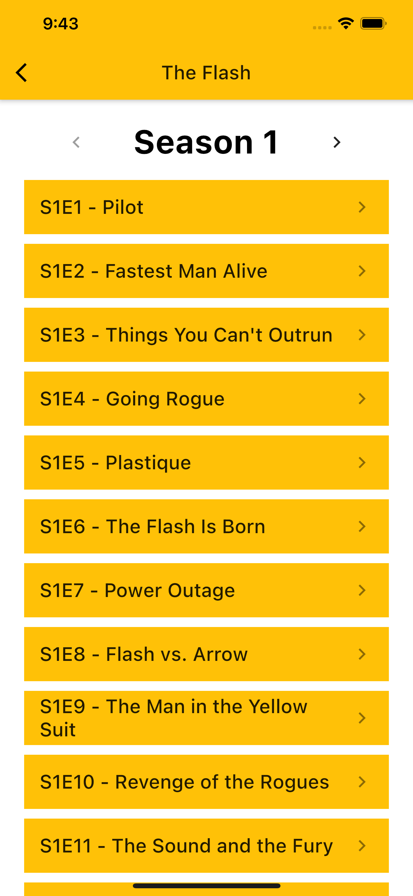
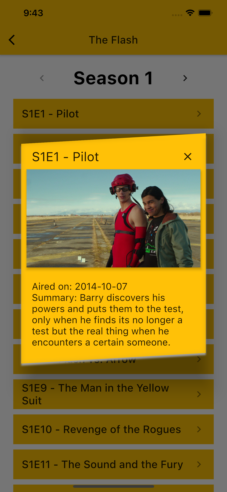

# TVMaze App
A Flutter project consuming the TVMaze API.

# Screenshots
<div align="center">
    <p align="center">
    
    
    
    </p>
    <p align="center">
    
    
    
    </p>
    <p align="center">
    
    
    
    </p>
</div>

# How to build
1. Make sure your environment is properly set up:
```
flutter doctor -v
```
2. Clone this repository:
```
git clone https://github.com/ericomine/tvmaze_app.git
```
3. Get into the project folder and update packages:
```
cd tvmaze_app
flutter pub get
```
4. Run the app:
```
flutter run

# Running it in release mode should yield better performance
flutter run --release 
```

# Project requirements
All required features have been developed, which are:
- List TV shows from TVMaze API using pagination.
- Searching TV shows by name.
- List these TV shows, exhibiting its name and poster image.
- Clicking on a TV show entry navigates to a series details page.
- Clicking on a TV show entry navigates to a episode details page.

The following optional features have been developed:
- Allow the user to save and list his/hers favorite TV shows.
- Protect the app with fingerprint authentication (Android only).

The following optional feature have not been developed:
- Allow the user to search people from the TV shows and see their details.
- Authenticate by PIN.

The reason I have chosen not to work on these features is that they're similar to the TV show search and the authentication by fingerprint features, so I preferred to improve the previously implemented code, thus favouring quality over quantity.

# Branches:
Please note that I have used git flow in this project. I have numbered the branches in the order they were developed and no branch has been deleted. If desired, you can navigate through commits or branches in order to see how the codebase has evolved.

# Architecture:
This project is based on Clean Architecture, as popularized in the Flutter community by Resocoder. As this knowledge is widely spread in the community and I cannot explain Clean Architecture shortly, please refer to Resocoder's [material](https://resocoder.com/2019/08/27/flutter-tdd-clean-architecture-course-1-explanation-project-structure/) if necessary.

In the "ideally clean" organization, each part of the project has very specific roles. However, this does generate a lot of boilerplate, so I have made a few compromises while developing the project:

1. I have not written use cases to obtain the entites I use in the application layer, instead I used repositories directly.
2. I have implemented repository contracts and concretions, but they're on the same file in the data-layer folder.
3. I have only implemented repositories towards the end of the project, so as to implement error handling and logging.

Because this is a small project, I think that it'd be overengineering to start with all the boilerplate laid out.

# On UI/UX
I have tried to create a simple and comfortable experience for the user of the app, but yet with a distinguishable look that comes from the skewed cards which "fit" into each other to provide a sense of flow.

The home page only contains a list of the retrieved TV shows and the search bar, lightly taking inspiration from google.com. A modal bottom sheet, which is out of sight when not necessary and contributes to the cleanliness of the home page, allows the user to go the favorites page or reset the fingerprint settings. In case I had implemented the people search, I would have put some control in this modal bottom sheet to switch between tv show/person search.

I have also implemented deboucing in the search bar, so as to improve the experience of the user when typing a new search query. The search bar also gets a "keyboard down" icon button for iOS users who can't close the keyboard with the back button as in Android.

Regarding the authentication by fingerprint feature, I've also tried to implement it the most "out of sight" way, so that the if the user refuses to use fingerprint once, he'll have to go to the menu and reset it by him/herself.

The details page could be fairly improved. They are a bit dull because most of their content is text and there is little graphic material to break the flow. These are also likely the classes which would benefit the most from some refactoring as of now.

# On native platform specificities

The authentication by fingerprint requires tweaks in the native files of the project. I have only made the necessary changes in the Android files, so that this feature is not working in iOS.

# On unit tests

Usually, in my projects, I tend to focus my testing efforts on the use cases, which tend to have more complicated business rules. Because this project has no use cases, I have written very few tests.

I have only provided unit tests for deserialization of the JSON objects received from the API. These could be fairly improved by the use of fixtures and a separate test suite which calls the API (in my test suite I directly call the API).

# Credits
TV Static Video by Engin Akyurt from (Pexels[https://www.pexels.com/video/an-old-portable-television-3290546/])
